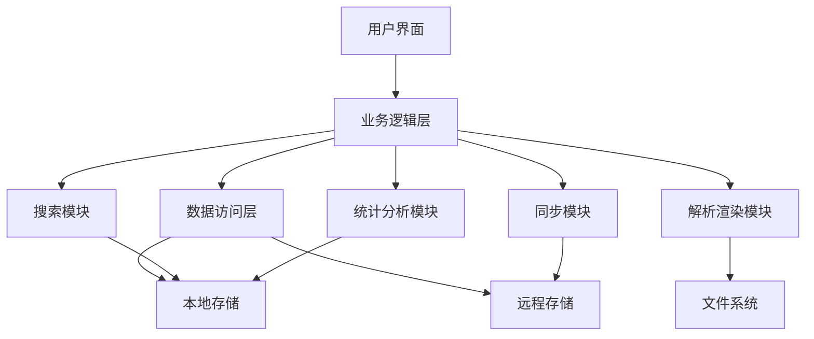

# SmileReader 跨平台阅读软件设计文档

## 1. 项目概述

### 1.1 项目背景

随着移动互联网的发展和智能设备的普及，数字阅读已经成为人们获取信息和知识的重要方式。然而，当前市场上的阅读软件存在诸多问题，如格式支持有限、跨平台体验不一致、功能单一等。为了解决这些问题，我们计划开发一款支持多种文本格式、跨平台兼容、功能丰富的阅读软件 SmileReader，为用户提供统一、流畅的阅读体验。

### 1.2 项目目标

- 支持主流文本格式的解析与渲染，包括TXT、EPUB、PDF、MOBI、DOCX等
- 实现跨平台兼容，覆盖iOS、Android、Web和桌面端
- 提供丰富的阅读功能，如书签、笔记、阅读统计等
- 优化阅读体验，支持自定义阅读设置（字体、主题、布局等）
- 提供云存储集成，方便用户管理和备份电子书
- 提供直观、美观的用户界面，确保良好的用户体验

### 1.3 适用范围

本软件适用于所有需要阅读电子书籍、文档的用户，特别是那些经常在多设备间切换阅读的用户。软件支持个人使用场景，也可用于教育、企业等组织场景。

## 2. 功能需求分析

### 2.1 核心功能

1. **多格式文件支持**
   - 支持TXT、EPUB、PDF、MOBI、DOCX等主流文本格式
   - 自动检测和解析文件格式
   - 支持文件导入（本地文件、云存储）

2. **跨平台兼容**
   - 支持iOS、Android、Web和桌面端
   - 统一的用户界面和交互体验
   - 适配不同屏幕尺寸和分辨率

3. **文件管理**
   - 本地文件浏览和管理（列表视图和网格视图）
   - 云存储文件管理
   - 文件分类和标签管理（按文件格式分类）
   - 文件搜索功能
   - 文件排序（按名称、大小、修改时间、阅读进度）
   - 批量操作（删除、移动、重命名）

4. **阅读功能**
   - 文本阅读（TXT、EPUB、MOBI、DOCX）
   - PDF阅读（支持注释、搜索）
   - 阅读进度自动保存和显示
   - 字体大小、样式、行间距调整
   - 主题切换（浅色、深色、夜间）
   - 翻页模式切换（仿真、覆盖、滚动）
   - 目录导航
   - 内容搜索

5. **书签和笔记**
   - 添加、编辑、删除书签
   - 添加文本笔记和高亮
   - 笔记和书签分类管理
   - 笔记导出功能

6. **阅读统计**
   - 阅读时长统计
   - 阅读进度统计
   - 阅读频率分析

7. **同步功能**
   - 阅读进度同步
   - 书签和笔记同步
   - 设置同步

8. **搜索功能**
   - 书籍内容搜索
   - 书签和笔记搜索
   - 本地文件搜索

9. **书架管理**
   - 书籍封面显示
   - 最近阅读书籍展示
   - 书籍分类和排序
   - 阅读进度可视化

### 2.2 辅助功能

1. **自定义设置**
   - 账户管理（登录/注册）
   - 阅读偏好设置（默认字体、主题、布局）
   - 云同步设置
   - 存储管理（本地存储、清理缓存）
   - 应用主题设置（浅色、深色）
   - 安全设置（应用锁、数据加密）
   - 关于应用（版本信息、崩溃日志、隐私政策、用户协议、免责声明）

2. **云存储集成**
   - 支持主流云存储服务（WebDAV挂载、Dropbox、Google Drive、OneDrive等）
   - WebDAV挂载功能：支持添加多个WebDAV服务器，自定义服务器地址、用户名和密码
   - 文件上传和下载
   - 自动备份功能
   - 云存储空间管理

### 2.3 非功能需求

1. **性能需求**
   - 启动时间：<3秒
   - 页面加载时间：<1秒
   - 响应时间：<0.5秒
   - 内存占用：<200MB

2. **可靠性需求**
   - 崩溃率：<0.1%
   - 数据丢失率：<0.01%
   - 网络异常处理：优雅降级

3. **安全性需求**
   - 数据加密存储
   - 网络传输加密
   - 权限管理严格

4. **可用性需求**
   - 界面简洁易用
   - 操作流程清晰
   - 支持离线使用

5. **兼容性需求**
   - 支持iOS 12+、Android 6.0+
   - 支持主流浏览器（Chrome、Firefox、Safari、Edge）
   - 支持Windows 10+、macOS 10.15+、Linux

## 3. 系统架构设计

### 3.1 整体架构

本软件采用分层架构设计，从上到下依次为：

1. **表示层**：负责用户界面展示和用户交互，包括各种页面、组件和路由管理。
2. **业务逻辑层**：负责处理核心业务逻辑，如阅读管理、文件管理、同步管理等。
3. **数据访问层**：负责数据的存储和检索，包括本地存储和远程存储。
4. **底层服务层**：负责提供基础服务，如文件系统操作、网络请求、加密解密等。

### 3.2 模块划分

软件划分为以下核心模块：

1. **文件管理模块**：负责文件的导入、导出、浏览和管理。
2. **阅读模块**：负责文本内容的展示和阅读交互。
3. **解析渲染模块**：负责不同格式文件的解析和渲染。
4. **同步模块**：负责数据的同步和备份。
5. **搜索模块**：负责内容的搜索和检索。
6. **统计分析模块**：负责阅读数据的统计和分析。
8. **设置模块**：负责用户偏好设置的管理。

### 3.3 数据流图



## 4. 核心功能模块设计

### 4.1 文件管理模块

#### 4.1.1 功能描述

负责电子书文件的导入、导出、浏览、分类和管理，支持本地文件和云存储文件。

#### 4.1.2 模块结构

- **文件导入**：支持从本地文件系统、云存储服务导入文件。
- **文件浏览**：提供文件列表、文件夹视图，支持按名称、大小、日期排序。
- **文件分类**：支持手动分类和自动分类（按格式、作者、标签等）。
- **文件操作**：支持重命名、删除、移动、分享等操作。
- **云存储集成**：支持连接和管理Dropbox、Google Drive、OneDrive等云存储服务。

#### 4.1.3 关键API

- `FileManager.importFile()`：导入文件
- `FileManager.browseFiles()`：浏览文件
- `FileManager.getClassifiedFiles()`：获取分类文件
- `FileManager.operateFile()`：操作文件
- `CloudStorage.connect()`：连接云存储
- `CloudStorage.syncFiles()`：同步云文件

### 4.2 阅读模块

#### 4.2.1 功能描述

负责文本内容的展示和阅读交互，支持不同格式文件的阅读体验优化。

#### 4.2.2 模块结构

- **阅读器核心**：负责文本渲染和页面管理。
- **阅读控制**：提供翻页、目录导航、搜索等功能。
- **阅读设置**：支持字体、字号、行间距、背景色等设置。
- **书签管理**：支持添加、编辑、删除书签。
- **笔记管理**：支持添加文本笔记和高亮。
- **阅读进度**：自动保存和恢复阅读进度。

#### 4.2.3 关键API

- `Reader.openBook()`：打开书籍
- `Reader.renderContent()`：渲染内容
- `Reader.navigateTo()`：导航到指定位置
- `Reader.saveProgress()`：保存阅读进度
- `BookmarkManager.addBookmark()`：添加书签
- `NoteManager.addNote()`：添加笔记

### 4.3 解析渲染模块

#### 4.3.1 功能描述

负责不同格式文件的解析和渲染，确保内容正确显示。

#### 4.3.2 模块结构

- **TXT解析**：负责纯文本文件的解析和渲染。
- **EPUB解析**：负责EPUB格式文件的解析和渲染。
- **PDF解析**：负责PDF格式文件的解析和渲染。
- **MOBI解析**：负责MOBI格式文件的解析和渲染。
- **通用渲染器**：提供统一的渲染接口和功能。

#### 4.3.3 关键API

- `ParserFactory.createParser()`：创建解析器
- `Parser.parse()`：解析文件
- `RendererFactory.createRenderer()`：创建渲染器
- `Renderer.render()`：渲染内容

### 4.4 同步模块

#### 4.4.1 功能描述

负责数据的同步和备份，确保多设备间数据一致。

#### 4.4.2 模块结构

- **同步核心**：负责同步逻辑和冲突解决。
- **阅读进度同步**：同步阅读进度数据。
- **书签笔记同步**：同步书签和笔记数据。
- **设置同步**：同步用户偏好设置。
- **云备份**：将数据备份到云存储。

#### 4.4.3 关键API

- `SyncManager.syncData()`：同步数据
- `SyncManager.resolveConflict()`：解决同步冲突
- `BackupManager.backupData()`：备份数据
- `BackupManager.restoreData()`：恢复数据

### 4.5 搜索模块

#### 4.5.1 功能描述

负责内容的搜索和检索，提高用户查找效率。

#### 4.5.2 模块结构

- **全文搜索**：支持书籍内容的全文搜索。
- **元数据搜索**：支持按书名、作者、标签等搜索。
- **书签笔记搜索**：支持搜索书签和笔记内容。
- **搜索结果管理**：提供搜索结果的排序和过滤。

#### 4.5.3 关键API

- `SearchManager.searchContent()`：搜索内容
- `SearchManager.searchMetadata()`：搜索元数据
- `SearchManager.searchBookmarks()`：搜索书签
- `SearchManager.searchNotes()`：搜索笔记

### 4.6 统计分析模块

#### 4.6.1 功能描述

负责阅读数据的统计和分析，帮助用户了解阅读习惯。

#### 4.6.2 模块结构

- **阅读时长统计**：统计用户的阅读时长。
- **阅读进度统计**：统计书籍的阅读进度。
- **阅读频率分析**：分析用户的阅读频率和偏好。
- **数据可视化**：以图表形式展示统计数据。

#### 4.6.3 关键API

- `StatisticsManager.trackReadingTime()`：跟踪阅读时长
- `StatisticsManager.calculateProgress()`：计算阅读进度
- `StatisticsManager.analyzeReadingPattern()`：分析阅读模式
- `StatisticsManager.generateReport()`：生成统计报告

## 5. 数据模型设计

### 5.1 数据实体

1. **WebDAV服务器（WebDAVServer）**
   - id: String
   - name: String
   - url: String
   - username: String
   - password: String（加密存储）
   - addedAt: DateTime
   - lastUsedAt: DateTime

2. **书籍（Book）**
   - id: String
   - title: String
   - author: String
   - coverPath: String
   - filePath: String
   - format: String
   - size: Integer
   - addedAt: DateTime
   - lastReadAt: DateTime
   - totalPages: Integer
   - currentPage: Integer
   - readingProgress: Float

3. **书签（Bookmark）**
   - id: String
   - bookId: String
   - title: String
   - content: String
   - page: Integer
   - position: Integer
   - createdAt: DateTime

4. **笔记（Note）**
   - id: String
   - bookId: String
   - content: String
   - page: Integer
   - position: Integer
   - createdAt: DateTime
   - updatedAt: DateTime

5. **阅读统计（ReadingStatistics）**
   - id: String
   - bookId: String
   - userId: String
   - readingTime: Integer（分钟）
   - date: Date
   - startPage: Integer
   - endPage: Integer

6. **设置（Setting）**
   - id: String
   - userId: String
   - key: String
   - value: String

7. **分类（Category）**
   - id: String
   - name: String
   - color: String
   - createdAt: DateTime

8. **书籍分类关联（BookCategory）**
   - bookId: String
   - categoryId: String

### 5.2 数据关系

- 书籍与书签：一对多
- 书籍与笔记：一对多
- 书籍与阅读统计：一对多
- 书籍与分类：多对多（通过BookCategory关联）

### 5.3 存储方案

1. **本地存储**
   - **SQLite**：存储结构化数据，如书籍元数据、书签、笔记、阅读统计、WebDAV服务器配置等。
   - **SharedPreferences**：存储简单的键值对数据，如用户设置、应用状态等。
   - **文件系统**：存储电子书文件、封面图片等二进制数据。

2. **远程存储**
   - **Firebase Storage**：提供云存储服务，用于存储和同步电子书文件。
   - **WebDAV**：支持WebDAV协议，可连接到各种WebDAV服务器，用于文件存储和同步。
   - **其他云存储服务**：集成Dropbox、Google Drive、OneDrive等云存储服务，用于存储和同步电子书文件。

## 6. 用户界面设计

### 6.1 设计理念

- **简洁大方**：界面设计简洁明了，减少干扰，让用户专注于阅读内容。
- **一致性**：保持跨平台的界面一致性，提供统一的用户体验。
- **响应式**：适配不同屏幕尺寸和设备类型。
- **可访问性**：考虑不同用户的需求，提供良好的可访问性支持。
- **个性化**：允许用户自定义界面主题和阅读设置。

### 6.2 界面布局

#### 6.2.1 移动端布局

- **顶部导航栏**：包含应用名称、返回按钮和操作按钮。
- **底部导航栏**：包含书架、文件、添加书籍、笔记、设置等主要入口。
- **书架页面**：展示最近阅读书籍和我的书架，支持网格视图。
- **文件管理页面**：支持列表视图和网格视图，包含分类标签和排序选项。
- **阅读器页面**：全屏阅读界面，顶部和底部有工具栏，点击屏幕中央显示控制菜单。
- **笔记页面**：包含笔记和书签标签页，支持分类筛选。
- **设置页面**：分组展示各种设置选项，如账户管理、阅读偏好、存储管理、应用主题、安全设置等。

#### 6.2.2 桌面端布局

- **侧边栏**：包含导航菜单和书籍分类。
- **主内容区**：展示书籍列表或阅读内容。
- **顶部工具栏**：提供搜索、设置等快捷操作。
- **状态栏**：显示阅读进度、时间等信息。

### 6.3 色彩方案

- **主色调**：蓝色（#3498db），代表知识、智慧和信任。
- **辅助色**：橙色（#f39c12），用于强调和交互元素。
- **中性色**：
  - 白色（#ffffff）：背景色
  - 浅灰（#f5f5f5）：卡片背景
  - 中灰（#9e9e9e）：次要文本
  - 深灰（#333333）：主要文本
- **功能色**：
  - 成功（#27ae60）
  - 警告（#f39c12）
  - 错误（#e74c3c）
  - 信息（#3498db）

### 6.4 交互流程

1. **文件导入流程**
   - 用户点击"导入"按钮
   - 选择导入方式（本地文件、云存储）
   - 浏览并选择文件
   - 确认导入
   - 系统解析文件并添加到书架

2. **阅读流程**
   - 用户从书架选择书籍
   - 系统打开阅读器并加载上次阅读位置
   - 用户阅读内容，可通过点击或滑动翻页
   - 点击屏幕中央显示控制菜单
   - 可调整阅读设置、添加书签/笔记、查看目录等
   - 退出阅读时自动保存进度

3. **设置流程**
   - 用户进入设置页面
   - 选择设置类别
   - 调整设置选项
   - 系统保存设置并应用

4. **笔记和书签管理流程**
   - 用户进入笔记页面
   - 切换笔记或书签标签页
   - 浏览、编辑或删除笔记/书签
   - 可按分类筛选笔记/书签
   - 可导出笔记

### 6.5 关键UI组件

1. **阅读器界面**
   - 阅读区域：显示文本内容
   - 顶部工具栏：包含返回按钮、书籍标题、目录和搜索按钮
   - 底部工具栏：包含页码信息、进度条、书签和笔记按钮
   - 阅读控制菜单：包含字体大小、字体类型、行间距、主题、页面布局等设置
   - 目录面板：显示书籍目录，支持导航

2. **书架界面**
   - 最近阅读区域：展示最近阅读的书籍，包含阅读进度
   - 我的书架区域：以网格形式展示书籍封面和基本信息
   - 推荐内容区域：展示推荐书籍
   - 搜索栏：用于搜索书籍

3. **文件管理界面**
   - 搜索和筛选栏：用于搜索文件和筛选文件
   - 工具栏：包含视图切换、排序选项和批量操作按钮
   - 分类标签：按文件格式分类（全部、TXT、PDF、EPUB、MOBI、DOCX）
   - 文件列表/网格：展示文件信息和阅读进度

4. **笔记界面**
   - 标签页切换：在笔记和书签之间切换
   - 搜索框：用于搜索笔记或书签
   - 分类筛选：按分类筛选笔记或书签
   - 笔记/书签列表：展示笔记/书签内容、来源和元数据

5. **设置界面**
   - 设置菜单：分组展示设置选项，包括阅读偏好、存储管理、应用主题、安全设置等
   - 开关控件：用于启用/禁用功能
   - 选择器：用于选择选项
   - 按钮：用于执行操作（清理缓存、添加WebDAV服务器）
   - WebDAV设置：支持添加、编辑、删除WebDAV服务器配置

## 7. 技术实现方案

### 7.1 技术栈选择

- **前端框架**：Flutter
- **开发语言**：Dart
- **状态管理**：Provider
- **本地存储**：SQLite（sqflite）、SharedPreferences
- **网络请求**：Dio
- **文件操作**：path_provider、file_picker
- **UI组件**：Flutter内置组件 + 自定义组件
- **云存储**：Firebase Storage
- **图标库**：Font Awesome
- **图表库**：charts_flutter（用于阅读统计）
- **WebDAV客户端**：webdav_client

### 7.2 第三方库依赖

1. **文件解析**
   - epub_view：EPUB格式解析和渲染
   - pdfx：PDF格式解析和渲染
   - mobi_reader：MOBI格式解析
   - docx：DOCX格式解析
   - charset_detector：文本编码检测

2. **UI/UX**
   - flutter_slidable：滑动操作
   - animated_splash_screen：启动动画
   - flutter_local_notifications：本地通知
   - shimmer：加载动画
   - font_awesome_flutter：Font Awesome图标库

3. **数据处理**
   - sqflite：本地数据库
   - shared_preferences：本地存储
   - hive：轻量级存储
   - charts_flutter：数据可视化

4. **网络和云服务**
   - firebase_storage：云存储
   - cloud_firestore：云数据库
   - dio：网络请求
   - webdav_client：WebDAV客户端实现

5. **工具类**
   - uuid：生成唯一ID
   - path：路径操作
   - crypto：加密解密
   - intl：国际化
   - path_provider：文件路径获取
   - file_picker：文件选择器

### 7.3 核心API设计

1. **文件管理API**
   ```dart
   class FileManager {
     Future<List<Book>> importFiles(List<String> paths);
     Future<List<Book>> browseFiles(String directory);
     Future<void> deleteFile(String filePath);
     Future<void> moveFile(String oldPath, String newPath);
     Future<void> renameFile(String oldPath, String newName);
     Future<String> getFileMetadata(String filePath);
     Future<List<Book>> getFilesByCategory(String category);
     Future<List<Book>> sortFiles(String sortBy);
     // WebDAV相关API
     Future<void> addWebDAVServer(String name, String url, String username, String password);
     Future<void> removeWebDAVServer(String serverId);
     Future<List<Map<String, dynamic>>> getWebDAVServers();
     Future<List<Book>> browseWebDAVServer(String serverId, String path);
   }
   ```

2. **阅读API**
   ```dart
   class Reader {
     Future<void> openBook(String bookId);
     Future<String> getContent(int page);
     Future<void> saveProgress(int page, int position);
     Future<Map<String, dynamic>> getProgress(String bookId);
     Future<void> setReadingSettings(Map<String, dynamic> settings);
     Future<List<Map<String, dynamic>>> getTableOfContents(String bookId);
     Future<List<SearchResult>> searchContent(String query);
   }
   ```

3. **同步API**
   ```dart
   class SyncManager {
     Future<void> syncReadingProgress(String bookId);
     Future<void> syncBookmarks(String bookId);
     Future<void> syncNotes(String bookId);
     Future<void> syncSettings();
     Future<bool> isSyncEnabled();
     Future<void> backupData();
     Future<void> restoreData();
   }
   ```

4. **搜索API**
   ```dart
   class SearchManager {
     Future<List<SearchResult>> searchContent(String query, List<String> bookIds);
     Future<List<Book>> searchBooks(String query);
     Future<List<Bookmark>> searchBookmarks(String query);
     Future<List<Note>> searchNotes(String query);
     Future<List<File>> searchFiles(String query);
   }
   ```

5. **统计API**
   ```dart
   class StatisticsManager {
     Future<Map<String, dynamic>> getReadingStats(DateTime startDate, DateTime endDate);
     Future<Map<String, dynamic>> getBookProgress(String bookId);
     Future<List<Map<String, dynamic>>> getReadingPattern();
     Future<void> trackReadingSession(String bookId, int duration);
     Future<Map<String, dynamic>> getOverallStatistics();
   }
   ```

6. **笔记和书签API**
   ```dart
   class NoteManager {
     Future<void> addNote(String bookId, String content, int page, int position, String type);
     Future<void> editNote(String noteId, String content);
     Future<void> deleteNote(String noteId);
     Future<List<Note>> getNotes(String bookId);
     Future<List<Note>> getNotesByCategory(String category);
     Future<void> exportNotes(List<String> noteIds, String format);
   }
   
   class BookmarkManager {
     Future<void> addBookmark(String bookId, String title, String content, int page, int position);
     Future<void> editBookmark(String bookmarkId, String title);
     Future<void> deleteBookmark(String bookmarkId);
     Future<List<Bookmark>> getBookmarks(String bookId);
     Future<List<Bookmark>> getBookmarksByCategory(String category);
   }
   ```

7. **设置API**
   ```dart
   class SettingsManager {
     Future<void> saveSetting(String key, dynamic value);
     Future<dynamic> getSetting(String key);
     Future<void> saveReadingSettings(Map<String, dynamic> settings);
     Future<Map<String, dynamic>> getReadingSettings();
     Future<void> saveAppTheme(String theme);
     Future<String> getAppTheme();
   }
   ```

### 7.4 跨平台实现策略

1. **平台差异处理**
   - 使用Flutter的Platform Channel与原生平台通信
   - 针对不同平台实现特定功能的适配
   - 使用条件编译处理平台特定代码
   - 适配不同平台的权限管理系统

2. **UI适配**
   - 使用Flutter的LayoutBuilder和MediaQuery进行响应式布局
   - 针对不同屏幕尺寸和方向设计适配方案
   - 使用平台特定的UI组件和交互模式
   - 实现移动端底部导航栏和桌面端侧边栏的适配
   - 确保字体大小和间距在不同平台上的一致性

3. **文件系统差异**
   - 使用path_provider库处理不同平台的文件路径
   - 针对不同平台的文件系统权限进行适配
   - 实现统一的文件操作接口
   - 适配不同平台的文件选择器

4. **性能优化**
   - 使用Flutter的性能分析工具进行性能监控
   - 针对不同平台的性能特点进行优化
   - 实现资源的按需加载和释放
   - 优化大文件的解析和渲染性能
   - 实现缓存机制减少重复操作

## 8. 性能优化策略

### 8.1 文件解析优化

- **流式解析**：对于大文件，使用流式解析减少内存占用。
- **解析缓存**：缓存解析结果，避免重复解析。
- **异步解析**：在后台线程进行文件解析，避免阻塞UI。
- **增量解析**：只解析当前需要的内容，其余内容按需解析。
- **格式优化**：针对不同文件格式采用不同的解析策略，提高解析效率。

### 8.2 渲染优化

- **分页加载**：只加载当前页和邻近页的内容。
- **虚拟列表**：对于长列表（如文件列表、笔记列表），使用虚拟列表减少渲染开销。
- **图片优化**：对图片进行压缩和懒加载，提高页面加载速度。
- **渲染缓存**：缓存已渲染的页面，提高翻页速度。
- **UI组件复用**：复用列表项和卡片组件，减少重建开销。

### 8.3 内存管理

- **对象池**：重用频繁创建的对象，减少内存分配和回收。
- **内存监控**：监控内存使用情况，及时释放不必要的资源。
- **弱引用**：对于非关键对象使用弱引用，允许垃圾回收。
- **资源释放**：在页面销毁时及时释放资源，避免内存泄漏。
- **大对象处理**：对于大对象（如书籍封面），使用适当的缓存策略。

### 8.4 网络请求优化

- **批量请求**：将多个小请求合并为一个大请求，减少网络开销。
- **请求缓存**：缓存网络请求结果，减少重复请求。
- **网络状态检测**：根据网络状态调整请求策略，在弱网环境下减少请求频率。
- **断点续传**：对于大文件传输，支持断点续传，提高传输可靠性。
- **延迟加载**：对于非关键资源，使用延迟加载策略。

### 8.5 存储优化

- **数据库索引**：为常用查询字段创建索引，提高查询速度。
- **数据压缩**：对存储的数据进行压缩，减少存储空间。
- **增量更新**：只更新变化的数据，减少写入操作。
- **存储清理**：定期清理无用数据，释放存储空间。
- **数据分片**：对于大量数据，采用分片存储策略，提高读写效率。

## 9. 兼容性考虑

### 9.1 平台差异处理

- **iOS**：
  - 权限管理：使用iOS的权限系统，在Info.plist中声明所需权限
  - 文件系统：使用iOS的沙盒机制，适配不同iOS版本的文件系统变化
  - UI适配：遵循iOS的设计规范，使用Cupertino组件
  - 性能优化：针对iOS设备的性能特点进行优化

- **Android**：
  - 权限管理：使用Android的运行时权限，适配不同Android版本的权限机制
  - 文件系统：适配不同版本的存储权限，特别是Android 10+的分区存储
  - UI适配：遵循Material Design规范，使用Material组件
  - 性能优化：针对不同Android设备的性能差异进行优化

- **Web**：
  - 性能优化：针对Web平台的性能特点进行优化，减少JavaScript执行时间
  - 存储限制：使用localStorage和IndexedDB，处理存储容量限制
  - 浏览器兼容性：支持主流浏览器（Chrome、Firefox、Safari、Edge）
  - 网络限制：处理跨域请求和网络安全限制

- **桌面端**：
  - 窗口管理：支持多窗口和窗口大小调整，适配不同桌面环境
  - 文件系统：直接访问本地文件系统，处理不同操作系统的路径差异
  - 性能优化：充分利用桌面端的硬件资源，提供更丰富的功能
  - 交互适配：支持键盘、鼠标和触摸交互

### 9.2 UI适配

- **响应式布局**：使用Flutter的LayoutBuilder和MediaQuery进行响应式布局，适配不同屏幕尺寸
- **平台特定控件**：使用Platform.isIOS和Platform.isAndroid判断平台，使用相应的平台特定控件
- **字体适配**：根据屏幕密度和尺寸调整字体大小，确保在不同设备上的可读性
- **触摸/鼠标交互**：同时支持触摸和鼠标交互，适配不同输入方式
- **方向适配**：支持横屏和竖屏模式，自动调整布局

### 9.3 文件系统差异

- **路径处理**：使用path_provider库获取平台特定的文件路径，处理不同操作系统的路径格式差异
- **文件访问**：适配不同平台的文件访问权限和限制，特别是移动平台的沙盒限制
- **文件格式**：考虑不同平台对文件格式的支持差异，确保核心格式在所有平台上都能正常解析
- **文件选择器**：适配不同平台的文件选择器，提供统一的用户体验

### 9.4 权限管理

- **iOS**：在Info.plist中声明所需权限，如文件访问、网络访问等
- **Android**：在AndroidManifest.xml中声明权限，并在运行时请求危险权限
- **Web**：使用浏览器的权限API，处理浏览器特有的权限限制
- **桌面端**：根据平台的权限系统进行适配，如Windows的UAC、macOS的沙盒权限

### 9.5 性能适配

- **设备能力检测**：检测设备的性能和内存情况，如CPU核心数、内存大小、存储容量等
- **资源调整**：根据设备能力调整资源使用策略，如在低性能设备上降低图片质量
- **降级策略**：在低性能设备上使用简化的功能和界面，确保基本功能的流畅运行
- **网络适配**：根据网络环境调整同步和下载策略，在弱网环境下减少数据传输


## 10. 部署与发布

### 10.1 构建流程

1. **开发环境配置**：
   - 安装Flutter SDK（最新稳定版本）
   - 配置IDE（Android Studio、VS Code）
   - 设置模拟器和真机测试环境
   - 配置Flutter web和桌面端支持

2. **构建步骤**：
   - 代码检查和测试（单元测试、集成测试、UI测试）
   - 构建Debug版本进行测试
   - 构建Release版本进行发布
   - 签名和打包（Android APK/AAB、iOS IPA、Web部署包、桌面端安装包）

3. **自动化构建**：
   - 使用CI/CD工具（如GitHub Actions、Jenkins）
   - 自动运行测试和构建
   - 生成构建报告和测试覆盖率报告
   - 部署到测试环境进行验证

### 10.2 发布策略

1. **应用商店发布**：
   - iOS：App Store
   - Android：Google Play Store
   - Web：Web应用托管服务（如Firebase Hosting、Vercel）
   - 桌面端：Microsoft Store、Mac App Store、Linux软件中心

2. **版本策略**：
   - 使用语义化版本号（MAJOR.MINOR.PATCH）
   - 定期发布更新（如每月一次小更新，每季度一次大更新）
   - 提供测试版本（如beta版）供用户体验新功能
   - 维护长期支持（LTS）版本

3. **发布检查清单**：
   - 功能测试通过
   - 性能测试通过
   - 兼容性测试通过（覆盖主要设备和平台版本）
   - 安全检查通过（如代码扫描、漏洞检测）
   - 合规性检查通过（如隐私政策、用户协议）
   - 应用商店审核要求检查通过

### 10.3 版本管理

- **分支管理**：
  - main：主分支，用于发布稳定版本
  - develop：开发分支，用于集成新功能
  - feature：特性分支，用于开发特定功能
  - hotfix：修复分支，用于修复紧急问题
  - release：发布分支，用于准备发布版本

- **版本控制**：
  - 使用Git进行版本控制
  - 提交规范：使用语义化提交信息（如feat、fix、docs、style、refactor、test、chore）
  - 标签管理：为发布版本创建标签（如v1.0.0）
  - 变更日志：自动生成变更日志，记录版本更新内容


## 11. 测试计划

### 11.1 测试策略

- **单元测试**：测试各个模块的核心功能，如文件解析、数据处理、业务逻辑等。
- **集成测试**：测试模块之间的交互，如文件管理与阅读模块的集成、同步模块与云服务的集成等。
- **UI测试**：测试用户界面的功能和交互，确保界面元素正常显示和响应。
- **性能测试**：测试软件的性能指标，如启动时间、页面加载时间、响应时间等。
- **兼容性测试**：测试软件在不同平台、设备和浏览器上的表现。
- **安全测试**：测试软件的安全性，如数据加密、权限管理、网络传输安全等。
- **回归测试**：在每次代码变更后进行测试，确保原有功能正常运行。

### 11.2 测试用例

1. **文件管理测试**
   - 测试文件导入功能（本地文件、云存储）
   - 测试文件浏览和管理功能（列表视图、网格视图）
   - 测试文件分类功能（按格式分类）
   - 测试文件排序功能（按名称、大小、修改时间、阅读进度）
   - 测试批量操作功能（删除、移动、重命名）
   - 测试云存储集成功能（文件上传、下载、同步）

2. **阅读功能测试**
   - 测试不同格式文件的打开和阅读（TXT、EPUB、PDF、MOBI、DOCX）
   - 测试阅读设置的调整（字体大小、字体类型、行间距、主题、页面布局）
   - 测试书签和笔记功能（添加、编辑、删除、导出）
   - 测试阅读进度保存和恢复
   - 测试目录导航功能
   - 测试内容搜索功能

3. **书架管理测试**
   - 测试最近阅读书籍展示
   - 测试我的书架书籍展示（网格视图）
   - 测试推荐内容展示
   - 测试书籍封面显示
   - 测试阅读进度可视化

4. **笔记和书签测试**
   - 测试笔记添加、编辑、删除功能
   - 测试书签添加、编辑、删除功能
   - 测试笔记和书签分类管理
   - 测试笔记导出功能
   - 测试笔记和书签搜索功能

5. **设置功能测试**
   - 测试阅读偏好设置（默认字体、主题、布局）
   - 测试云同步设置
   - 测试存储管理功能（本地存储、清理缓存、WebDAV挂载）
   - 测试应用主题设置（浅色、深色）
   - 测试安全设置（应用锁、数据加密）

6. **同步功能测试**
   - 测试阅读进度同步
   - 测试书签和笔记同步
   - 测试设置同步
   - 测试云备份和恢复

7. **搜索功能测试**
   - 测试书籍内容搜索
   - 测试元数据搜索
   - 测试书签和笔记搜索
   - 测试文件搜索
   - 测试搜索结果的准确性和排序

8. **统计功能测试**
   - 测试阅读时长统计
   - 测试阅读进度统计
   - 测试阅读模式分析
   - 测试统计数据的可视化
   - 测试总体统计功能

### 11.3 性能测试

- **启动时间测试**：测量应用的启动时间，确保在3秒内完成启动。
- **页面加载测试**：测量页面的加载时间，确保在1秒内完成加载。
- **响应时间测试**：测量用户操作的响应时间，确保在0.5秒内响应。
- **内存使用测试**：测量应用的内存占用，确保不超过200MB。
- **电池消耗测试**：测量应用的电池消耗，确保在正常使用情况下电池消耗合理。
- **文件解析性能测试**：测量不同大小和格式文件的解析时间，确保大文件解析不超过5秒。
- **渲染性能测试**：测量页面渲染性能，确保滚动和翻页流畅。
- **网络性能测试**：测量网络请求性能，确保在弱网环境下仍能正常工作。

### 11.4 兼容性测试

- **平台兼容性测试**：测试软件在iOS、Android、Web和桌面端的表现，确保功能一致性。
- **设备兼容性测试**：测试软件在不同型号和配置设备上的表现，覆盖高中低端设备。
- **操作系统版本兼容性测试**：测试软件在不同版本操作系统上的表现，确保支持目标版本范围。
- **浏览器兼容性测试**：测试Web版本在不同浏览器上的表现，支持Chrome、Firefox、Safari、Edge等主流浏览器。
- **屏幕尺寸兼容性测试**：测试软件在不同屏幕尺寸和分辨率设备上的表现，确保布局适配正确。

## 12. 项目管理

### 12.1 开发流程

- **需求分析**：分析用户需求，确定功能范围，参考HTML原型设计。
- **设计阶段**：进行系统设计、UI设计和数据库设计，确保与HTML原型一致。
- **开发阶段**：实现各个功能模块，采用敏捷开发方法，定期进行代码审查。
- **测试阶段**：进行各种测试，包括单元测试、集成测试、UI测试、性能测试和兼容性测试。
- **发布阶段**：发布软件到各个平台，遵循各平台的发布规范。
- **维护阶段**：修复bug，更新功能，提供技术支持，收集用户反馈并持续改进。

### 12.2 团队分工

- **项目经理**：负责项目规划、进度管理、资源协调和风险评估。
- **产品经理**：负责需求分析、产品设计、用户体验和功能规划。
- **UI/UX设计师**：负责用户界面设计、交互设计和视觉设计，确保与HTML原型一致。
- **Flutter开发工程师**：负责前端开发、跨平台实现和性能优化。
- **后端开发工程师**：负责后端服务、API开发和云服务集成。
- **测试工程师**：负责软件测试、质量保证和测试自动化。
- **运维工程师**：负责部署、监控、维护和CI/CD流程管理。

### 12.3 风险评估

1. **技术风险**：
   - 风险：Flutter版本更新可能导致兼容性问题
   - 对策：锁定依赖版本，定期测试兼容性，建立自动化测试流程

2. **性能风险**：
   - 风险：大文件解析可能导致性能问题
   - 对策：实现增量解析、缓存机制和后台解析，优化渲染性能

3. **兼容性风险**：
   - 风险：不同平台的差异可能导致功能异常
   - 对策：充分测试，使用平台特定代码处理差异，建立兼容性测试矩阵

4. **安全风险**：
   - 风险：用户数据可能被泄露
   - 对策：实现数据加密，使用安全的网络传输，定期进行安全审计

5. **时间风险**：
   - 风险：开发时间可能超出预期
   - 对策：合理规划，使用敏捷开发方法，定期评估进度，设置里程碑

6. **资源风险**：
   - 风险：开发资源可能不足
   - 对策：提前规划资源需求，合理分配任务，考虑外包或扩展团队

7. **质量风险**：
   - 风险：软件质量可能不达标
   - 对策：建立严格的代码审查机制，实现自动化测试，进行全面的测试覆盖

8. **用户接受度风险**：
   - 风险：用户可能不接受或不喜欢软件
   - 对策：进行用户调研，收集反馈，迭代改进，提供良好的用户支持

## 13. 总结与展望

### 13.1 项目总结

本设计文档详细规划了 SmileReader 跨平台阅读软件的开发方案，包括功能需求、系统架构、数据模型、用户界面、技术实现、性能优化、兼容性考虑等方面。软件采用Flutter框架实现跨平台兼容，支持多种文本格式（TXT、EPUB、PDF、MOBI、DOCX等）的解析与渲染，提供丰富的阅读功能（如书签、笔记、阅读统计等）和良好的用户体验。

基于HTML原型设计，SmileReader 实现了以下核心功能：
- 美观的书架界面，展示最近阅读和推荐书籍
- 功能强大的文件管理，支持多种视图和分类
- 沉浸式阅读体验，支持多种阅读设置和主题
- 完善的笔记和书签管理系统
- 全面的设置选项，包括账户、阅读偏好、存储和安全
- 可靠的数据同步和备份功能

### 13.2 未来规划

1. **功能扩展**：
   - 支持更多文件格式（如AZW3、CBZ等）
   - 增加听书功能（文本转语音）
   - 实现社交分享功能（分享阅读心得、笔记）
   - 添加字典和翻译功能
   - 增加阅读目标和成就系统
   - 支持PDF编辑功能

2. **技术升级**：
   - 采用Flutter最新版本和特性
   - 优化性能和用户体验
   - 实现更智能的阅读推荐系统
   - 引入机器学习技术，提供个性化阅读体验
   - 优化云同步性能和可靠性

3. **生态建设**：
   - 开发插件系统，支持第三方扩展
   - 建立开发者社区和API文档
   - 提供API接口，支持与其他应用集成
   - 开发配套的桌面端管理工具
   - 构建电子书资源平台

4. **商业模式**：
   - 免费基础版（包含核心功能）
   - 高级版订阅（解锁高级功能）
   - 云存储增值服务（更大的存储空间）
   - 电子书商店集成（购买和下载电子书）
   - 企业版（针对教育和企业用户）

5. **用户体验优化**：
   - 进一步优化界面设计和交互体验
   - 增加更多个性化设置选项
   - 提供更详细的阅读统计和分析
   - 优化多设备同步体验
   - 增强无障碍功能支持

通过不断的迭代和优化，我们相信 SmileReader 将成为用户首选的跨平台阅读工具，为用户带来更加便捷、舒适的阅读体验。